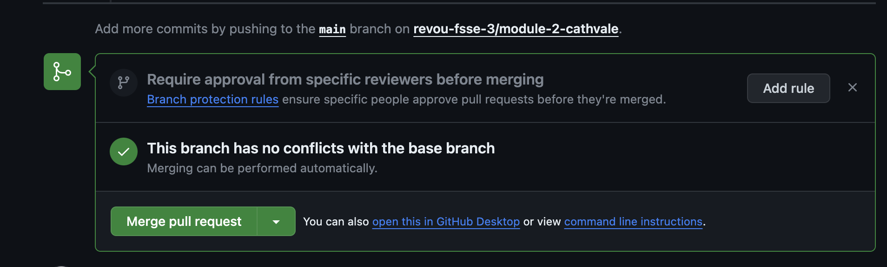

# Welcome to my Repository!
The objective of this repository is to implement a custom domain and practice doing pull requests on GitHub. I would appreciate it if you could visit my website: [ourtraveplan.site](https://ourtraveplan.site/)

Below are the step-by-step instructions on how to implement a custom domain and make pull requests on GitHub:

## Pull Request:
In summary, these steps are to combine the changes that have been made in another branch and in the main branch. Below are the step-by-step instructions on how to do a pull request:

### 1. Push Changes to New Branch 
 
After adding a new branch on GitHub and making changes locally, push the changes to GitHub via the terminal using the command: 'git push'

### 2. Go to Pull Request tab 
 
Go to GitHub; there should be a notification for the changes. Click 'Pull Request,' and GitHub will redirect you to the 'Pull Request' tab, showing the changes between the branches. Then, click 'Pull Request'

### 3. Create Pull Request 
 
GitHub will display the required form for you to fill in the title of the pull request and description. After filling in these forms, click 'Create Pull Request'

### 4. Merge the Pull Request  
 
After that, you will be redirected to the pull request homepage to the section of the changes, and you can click 'Merge Pull Request' to merge the changes

### 5. Merge is Success  
 
If the merge is successful, GitHub should display the result above, indicating that the pull request has been successfully merged

### 6. The Website is Successfully Changed 
 
The website has been successfully changed after the merge was successful

## Custom Domain:
In summary, these steps are essential to create a custom domain for your own website. Below are the step-by-step instructions on how to implement a custom domain:

### 1. Buy Domain  
 
The first step is to buy a domain from a website that sells domain names. In my case, I used Niagahoster and followed the steps until the domain was successfully purchased

### 2. Add site on Cloudflare  
 
After successfully purchasing the domain, go to Cloudflare, add a new site, and follow the steps until the site is successfully registered

### 3. Change Nameserver  
 
On Cloudflare, go to 'Nameserver' in the DNS navigation bar, and open a new tab to access Niagahoster. Then, go to the 'Domain' tab and select 'DNS/Nameserver,' and change the Nameserver on Niagahoster to match the Nameserver on Cloudflare

### 4. Set Custom Domain on Netlify 
 
Go to Netlify, select the chosen site, and proceed to add a custom domain. Enter your custom domain and follow the steps until the custom domain is successfully registered for your site

### 5. Manage the DNS on Cloudflare 
 
On Cloudflare, navigate to the 'DNS Management' section in the DNS navigation bar, and add a new record. In this case, I use CNAME to specify the custom domain and the Netlify domain. After the DNS is successfully configured, wait for a little while for the domain to propagate

### 6. Custom Domain Successfully Applied  
 
After everything is set up, type your custom domain into the browser, and your website should appear with your custom domain!